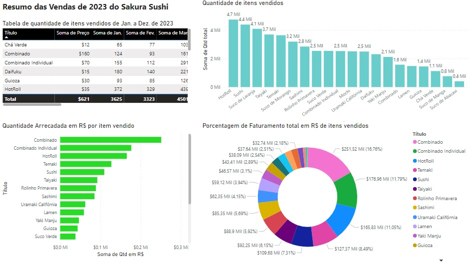
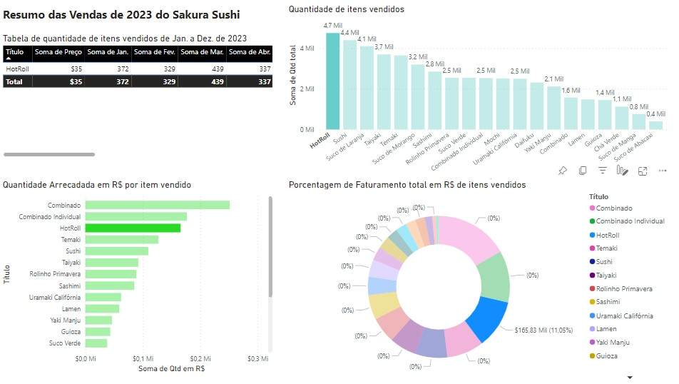
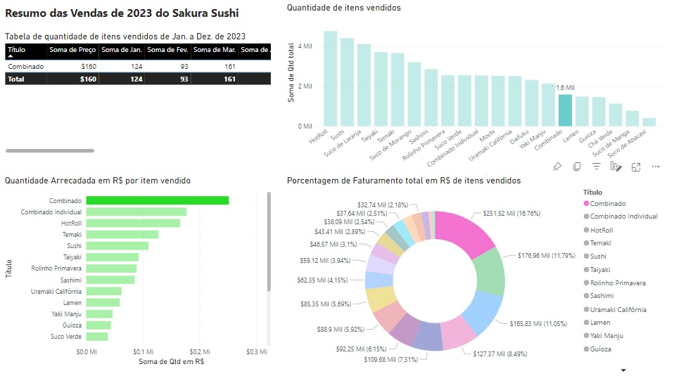

<h1 align="center">
    <a href="https://fernanda1701.github.io/sakura-sushi-power-bi/">Sakura Sushi 🌸 📊</a>
</h1>

 <b>Desafio 3</b> - Mentoria Girls Power Microsoft - Criação de um Dashboard em Power BI

<h2 align="center">

</h2>

## 💎 Sobre

O projeto foi desenvolvido para a fixação de conhecimentos em <b><i>Power BI</i></b>.
O desafio era criar um Dashboard a partir de uma tabela do <b>Excel</b>, que deveria identificar quais produtos do cardápio do <b>Sakura Sushi</b> 🌸 (do desafio 1) foram mais vendidos e quais deram mais lucro.

## 📖 Contexto

  Após sua modernização, o Sakura Sushi, elevou seu padrão. 
  
  Para ter um maior controle de suas finanças e continuar seu serviço com excelência e sem desperdícios, 
foi feita uma análise de todas as vendas dos seus itens presentes no cardápio de Janeiro a 
Dezembro de 2023, representadas em uma tabela do <b>Excel</b>.

O Power BI foi utilizado para destacar, não só o número de itens e os ganhos totais em R$(Reais) deles, mas também os produtos que foram mais vendidos e os que deram mais lucro. 

O restaurante possui um cardápio com 20 itens, dentre eles pratos principais, bebidas e sobremesas.
 
 
## 📊 Visualização de Dados

  Para melhor visualização, montamos um Dashboard demonstrando seus valores de forma mais detalhada e intuitiva. 
 

<h3 align="center">Dashboard</h3>

  

O Dashboard contém uma tabela detalhada dos dados de Janeiro a Dezembro de 2023 e gráficos para melhor visualização dos mesmos. O primeiro gráfico demonstra os itens mais vendidos, o segundo os mais rentáveis e o terceiro a porcentagem que o item representa no faturamento total.

<h3 align="center">Destaque para os produtos Mais Vendidos</h3>

  

 Surpreendentemente o prato mais vendido não foi o que deu mais lucro. O prato mais 
vendido foi o HotRoll com 4738 unidades, faturando R$165.830,00, ocupando a terceira 
posição dos mais rentosos. 

<h3 align="center">Destaque para os produtos que Deram Mais Lucro</h3>

  

E em primeiro lugar,dos produtos que deram mais lucro, temos o Combinado, faturando R$ 251.520,00 (o prato com maior faturamento) sendo o 15º mais vendido com 1572 itens.

Para conferir o <b>Dashboard</b> 📊 no <i><b>Power BI</b></i> ➞ <a href="https://app.powerbi.com/groups/me/reports/dcc4e6e1-898f-421d-
91f8-d7948bb3b612/ReportSection?experience=power-bi">Clique aqui!</a>

## 🛠 Tecnologias
 
- [Power BI](https://www.microsoft.com/pt-br/power-platform/products/power-bi)
- [Excel](https://www.microsoft.com/pt-br/microsoft-365/excel)
- Versionamento de código no [Git](https://git-scm.com/)

## Autor:

<a href="https://github.com/Fernanda1701">
 
  
 <b>Fernanda Nascimento</b></a> 

Entre em contato ✉️:

